# Grupo 2D — Trabajo Práctico 1

**[🔗 Ver sitio desplegado → tp1-parabellum-devs.vercel.app](https://tp1-parabellum-devs.vercel.app/)**

---

## Descripción del proyecto

Sitio web grupal desarrollado como trabajo práctico de la materia Frontend en el IFTS. El objetivo es presentar al equipo mediante páginas individuales de cada integrante, con información personal, habilidades, gustos y una sección de interactividad con JavaScript. El sitio incluye además una bitácora de desarrollo con el registro cronológico de decisiones, dificultades y cambios realizados durante el proceso. Todo el contenido es generado dinámicamente desde un único archivo de datos (`js/data.js`) mediante JavaScript vanilla, sin frameworks ni dependencias externas.

---

## Integrantes

| Nombre completo   | GitHub                                             |
| ----------------- | -------------------------------------------------- |
| Nicolás (Nico)    | [@NicoCris](https://github.com/NicoCris)           |
| Valeria Mansueto  | [@vlmnst](https://github.com/vlmnst)               |
| Antonella Masini  | [@Antocba](https://github.com/Antocba)             |
| Guillermo Novillo | [@guinovi](https://github.com/guinovi)             |
| Facundo Bascur    | [@FacundoBascur](https://github.com/FacundoBascur) |

---

## Tecnologías utilizadas

- HTML5 semántico
- CSS3 (custom properties, Grid, Flexbox, transiciones, filtros, transformaciones 3D)
- JavaScript vanilla (DOM API, módulo IIFE, sin dependencias externas)
- [Google Fonts — Fraunces](https://fonts.google.com/specimen/Fraunces)
- [Google Fonts — DM Sans](https://fonts.google.com/specimen/DM+Sans)

---

## Estructura de archivos

```text
/
├── index.html
├── bitacora.html
├── integrante1.html
├── integrante2.html
├── integrante3.html
├── integrante4.html
├── integrante5.html
├── css/
│   ├── styles.css
│   ├── integrante1.css
│   ├── integrante2.css
│   ├── integrante3.css
│   ├── integrante4.css
│   └── integrante5.css
├── js/
│   ├── data.js
│   └── app.js
├── img/
└── README.md
```

## Arquitectura del proyecto

- `js/data.js` — fuente única de datos: nombre del equipo, integrantes, habilidades, películas, discos, mensajes y entradas de bitácora.
- `js/app.js` — motor de renderizado: todas las funciones que construyen el DOM a partir de los datos. Sin frameworks, solo JavaScript vanilla.
- `css/styles.css` — variables globales, componentes compartidos y breakpoints responsivos.
- `css/integrante#.css` — estilos personalizados por perfil (colores de acento, variantes de cards, flip, favoritos, etc.).
- Cada HTML solo declara `data-page` en el `<body>`. Las páginas de integrantes también declaran `data-member-id`. Todo el contenido lo genera `app.js`.

---

## Funciones JavaScript (`js/app.js`)

### Utilidades generales

| Función                                 | Descripción                                                                                                                                                                                          | Ubicación   |
| --------------------------------------- | ---------------------------------------------------------------------------------------------------------------------------------------------------------------------------------------------------- | ----------- |
| `createElement(tag, options, children)` | Función base de todo el renderizado. Crea un elemento HTML con clase, texto, href, src, alt, type, atributos ARIA, estilos inline y nodos hijos. Soporta CSS custom properties con `--`.             | Toda la app |
| `getCurrentFile()`                      | Obtiene el nombre del archivo actual a partir de `window.location.pathname`. Se usa para marcar el link activo en la navegación.                                                                     | Nav         |
| `getMemberLinks()`                      | Genera el array de links `{ label, href }` para cada integrante a partir de `data.members`.                                                                                                          | Nav         |
| `avatarSource(member)`                  | Devuelve la URL de la foto si existe. Si no, genera y codifica un SVG inline con las iniciales del integrante sobre un fondo del color de acento del perfil. Evita imágenes rotas en cualquier caso. | Perfil      |

### Estructura de página (shell)

| Función                         | Descripción                                                                                                                                                                               | Sección           |
| ------------------------------- | ----------------------------------------------------------------------------------------------------------------------------------------------------------------------------------------- | ----------------- |
| `renderShell(content, options)` | Monta la estructura completa de la página: encabezado, navegación, `<main>` con el contenido recibido y pie de página. Usa `replaceChildren` para evitar duplicados.                      | Todas las páginas |
| `renderHeader(options)`         | Genera el bloque hero superior con eyebrow, título `<h1>` y párrafo de descripción. Acepta `options.eyebrow`, `options.title` y `options.copy`; si no se pasan, usa los datos del equipo. | Encabezado        |
| `renderHeroStats()`             | Construye el panel de estadísticas del header (`<dl>`) con cantidad de integrantes, entradas de bitácora y el badge "100% vanilla". Los valores se leen dinámicamente de `data`.          | Encabezado        |
| `renderNav()`                   | Genera la barra de navegación sticky con todos los links globales más uno por cada integrante. Aplica la clase `is-active` al link que corresponde al archivo actual.                     | Navegación        |
| `renderFooter()`                | Genera el pie de página con el nombre del equipo y la mención de tecnologías.                                                                                                             | Pie de página     |

### Portada (`index.html`)

| Función                    | Descripción                                                                                                                                                                                                             | Sección                            |
| -------------------------- | ----------------------------------------------------------------------------------------------------------------------------------------------------------------------------------------------------------------------- | ---------------------------------- |
| `renderHome()`             | Orquesta la portada: llama a `renderShell` con el encabezado del equipo, la grilla de tarjetas de integrantes y el panel de mensajes.                                                                                   | Portada                            |
| `renderMemberCard(member)` | Genera una tarjeta-link para cada integrante con número de orden, nombre y metadato (habilidades + ciudad o texto personalizado con `cardMeta`). El color de acento se pasa como CSS custom property `--member-accent`. | Sección "Integrantes del proyecto" |
| `renderMessagePanel()`     | Panel interactivo con un mensaje rotativo. Al hacer clic en "Mostrar otro mensaje", oculta el texto con una transición de opacidad y muestra el siguiente de la lista `data.homeMessages`.                              | Sección "Mensajes dinámicos"       |

### Páginas de integrantes (`integrante#.html`)

| Función                        | Descripción                                                                                                                                                                                             | Sección                      |
| ------------------------------ | ------------------------------------------------------------------------------------------------------------------------------------------------------------------------------------------------------- | ---------------------------- |
| `renderMemberPage()`           | Lee `data-member-id` del `<body>`, busca al integrante en `data.members` y delega en `renderProfileAside` + `renderProfileDetails`. También actualiza el `<title>` de la pestaña.                       | Página de perfil completa    |
| `renderProfileAside(member)`   | Genera la columna izquierda: foto (o avatar SVG), resumen con nombre, headline o ubicación/edad, lista de quick facts y links externos. Incluye el botón "Cambiar estilo" y el fallback de imagen rota. | Columna izquierda del perfil |
| `renderProfileDetails(member)` | Si el integrante tiene `sections`, usa el sistema de secciones enriquecidas. Si no, genera el formato estándar: habilidades, películas, discos y el bloque extra con toggle "Ver más".                  | Columna derecha del perfil   |

> **Botón "Cambiar estilo" (presente en todos los perfiles)**
> Presente en la columna izquierda de todos los perfiles. Cada clic avanza por un ciclo de 5 filtros CSS aplicados sobre la foto: sin filtro, escala de grises (`grayscale`), sépia, rotación de tono (`hue-rotate`) y saturación aumentada (`saturate`). El color del borde de la foto también cambia con cada estilo.

> **Botón "Ver más información" (perfiles sin `sections`)**
> Alterna la visibilidad del bloque `extra-info` con `classList.toggle('is-hidden')` y actualiza el texto del botón según el estado.

#### Capturas — Portada y perfiles

**Portada**

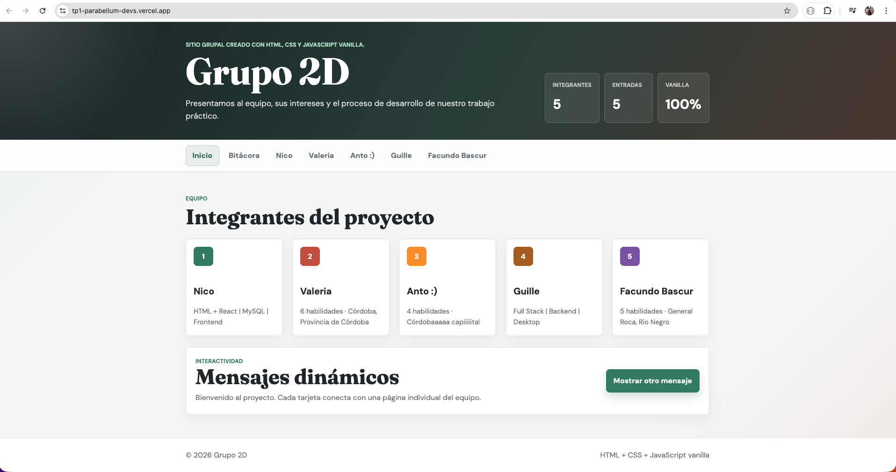

**Nico** — Perfil y cambio de estilo de foto

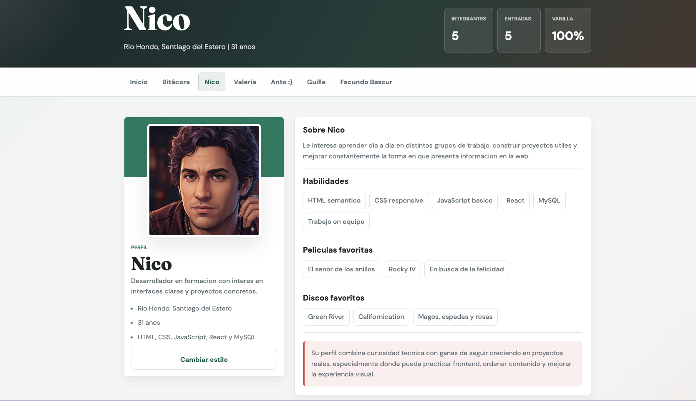
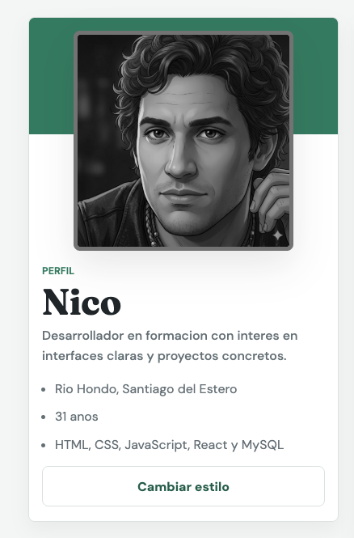

**Valeria** — Perfil y flip cards

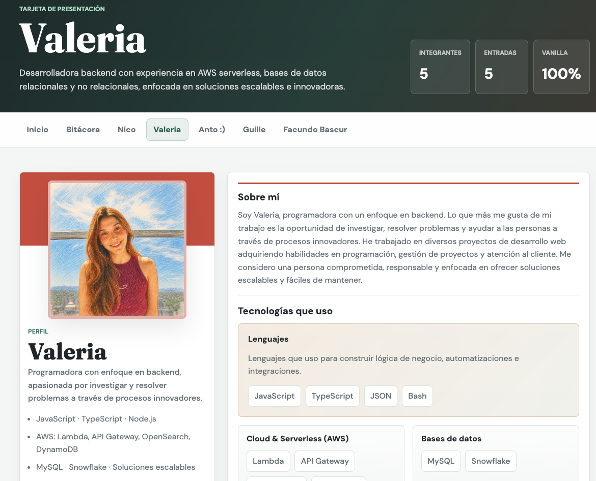
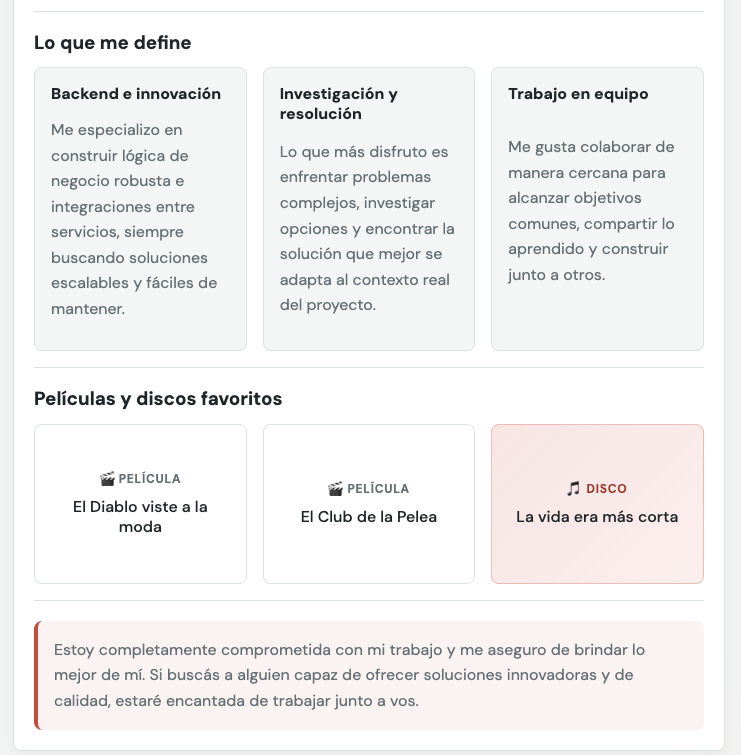

**Anto** — Perfil y flip cards

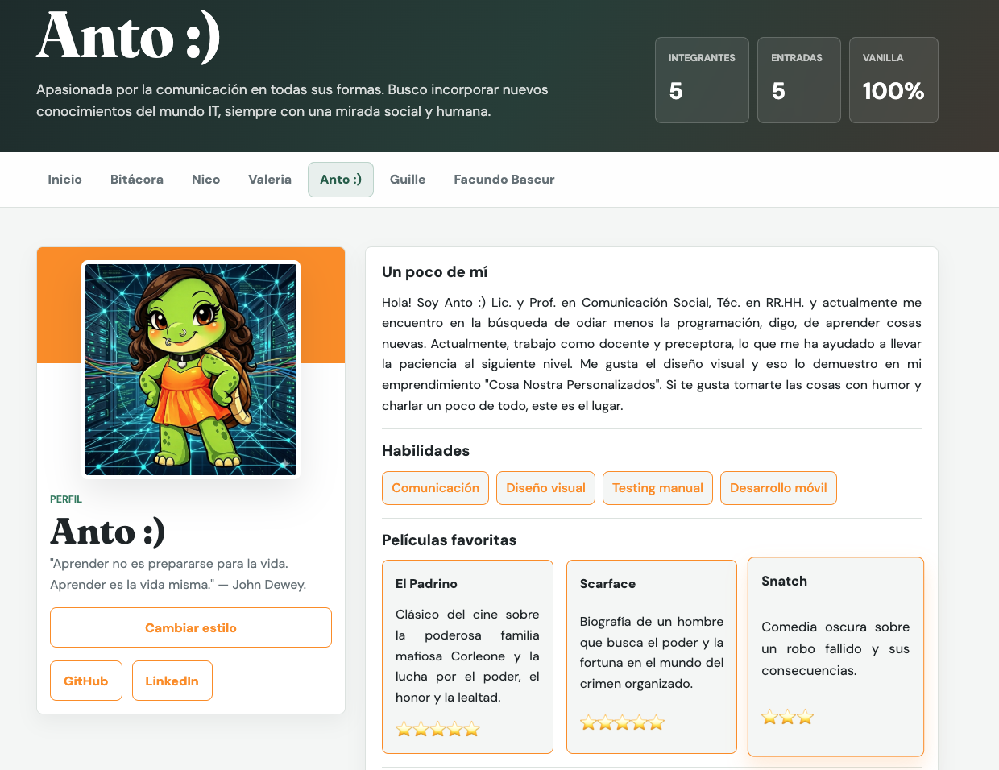
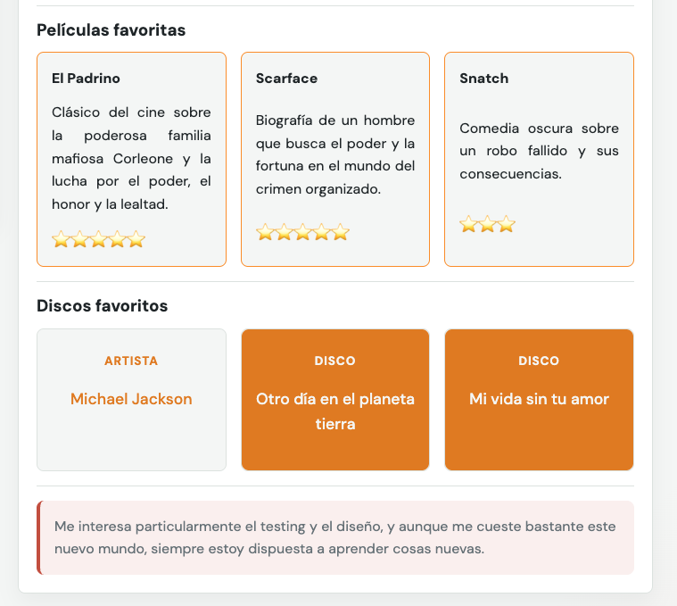

**Guillermo** — Perfil y panel de favoritos animado

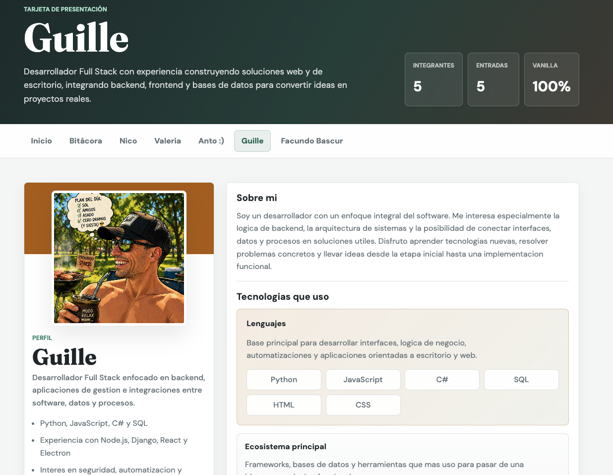
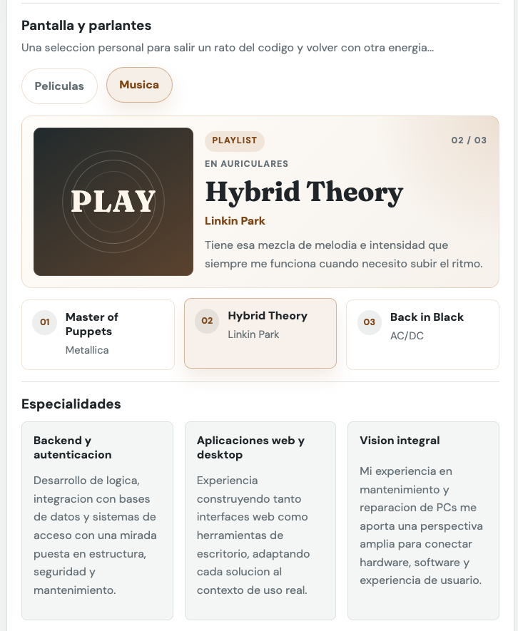

**Facundo** — Perfil y flip cards

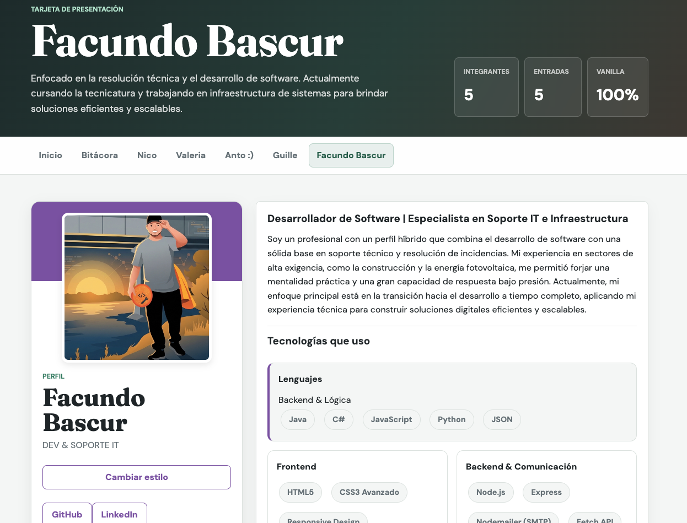
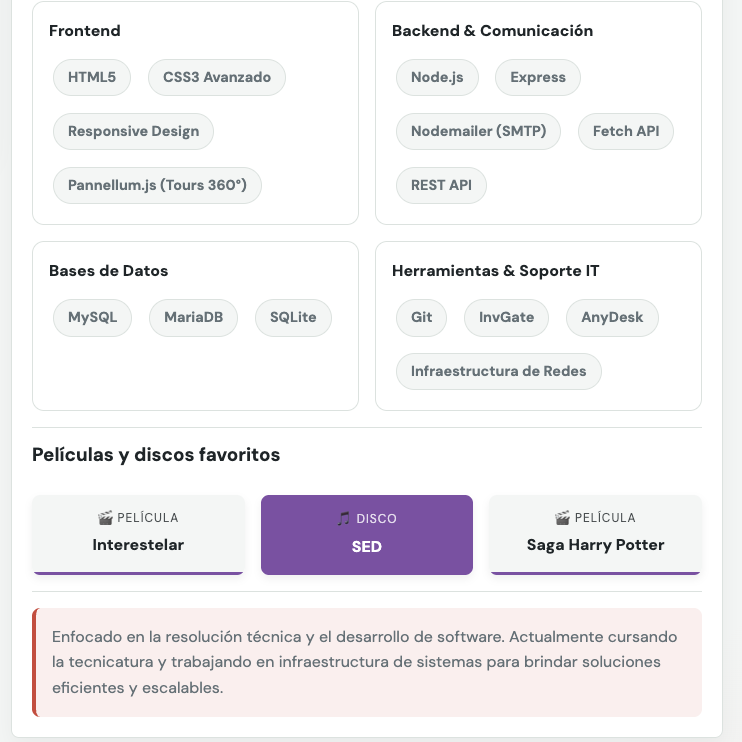

**Bitácora**

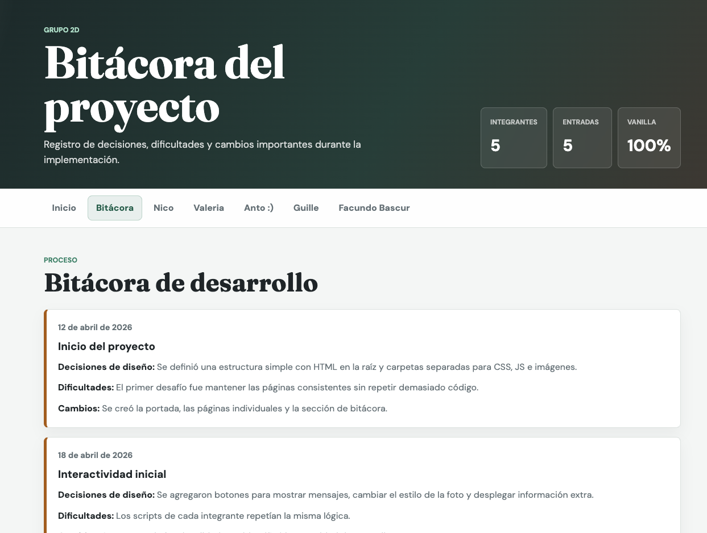

### Secciones enriquecidas del perfil

| Función                           | Tipo de sección | Descripción                                                                                                                                                                                                                                    | Usado en                                |
| --------------------------------- | --------------- | ---------------------------------------------------------------------------------------------------------------------------------------------------------------------------------------------------------------------------------------------- | --------------------------------------- |
| `renderListSection(title, items)` | `list`          | Genera un `<h3>` seguido de una lista de tags (`tag-list`). Compartido entre el formato estándar y el tipo `list` del sistema de secciones.                                                                                                    | Nico, perfiles estándar                 |
| `renderSectionIntro(section)`     | `intro`         | Párrafo de presentación personal con título y texto. Muestra una línea decorativa superior en los perfiles que la estilan con CSS.                                                                                                             | Nico, Valeria, Anto, Guillermo, Facundo |
| `renderSectionStack(section)`     | `stack`         | Grilla de tarjetas de tecnologías agrupadas por categoría. El grupo con `featured: true` ocupa el ancho completo. Soporta descripción opcional por grupo.                                                                                      | Valeria, Guillermo, Facundo             |
| `renderSectionProjects(section)`  | `projects`      | Grilla de proyectos con nombre, stack, descripción y link. Si no hay `href`, muestra un badge muted en lugar de un link activo.                                                                                                                | No usado actualmente                    |
| `renderSectionFocus(section)`     | `focus`         | Grilla de tarjetas de especialidades o áreas de interés. Cada card tiene título, descripción y campo opcional `puntaje` (usado para estrellas ⭐).                                                                                             | Valeria, Anto, Guillermo                |
| `renderSectionFlip(section)`      | `flip`          | Genera cards con efecto de giro 3D al pasar el mouse (`rotateY(180deg)`). El frente y dorso muestran pares de datos (ej. película / disco). Los labels de frente y dorso son configurables.                                                    | Valeria, Anto, Facundo                  |
| `renderSectionFavorites(section)` | `favorites`     | Panel interactivo con pestañas por categoría (películas, discos, etc.) y una lista de ítems. Al pasar el mouse, hacer clic o enfocar un ítem, el panel de presentación central se actualiza con nombre, metadato y nota del ítem seleccionado. | Guillermo                               |
| `renderSectionExtra(section)`     | `extra`         | Bloque de cierre siempre visible con borde lateral y fondo suave.                                                                                                                                                                              | Nico, Valeria, Anto, Guillermo, Facundo |
| `renderSection(section)`          | —               | Despachador: recibe una sección y llama al renderizador específico según `section.type`. Si el tipo no existe, devuelve un `<div>` vacío.                                                                                                      | Todos los perfiles con `sections`       |

### Bitácora (`bitacora.html`)

| Función                     | Descripción                                                                                                                              | Sección                  |
| --------------------------- | ---------------------------------------------------------------------------------------------------------------------------------------- | ------------------------ |
| `renderLog()`               | Orquesta la página de bitácora con encabezado descriptivo y la lista cronológica de entradas.                                            | Página de bitácora       |
| `renderLogEntry(entry)`     | Genera una entrada de la bitácora con fecha, título y tres filas de texto (decisiones, dificultades, cambios).                           | Línea de tiempo          |
| `renderLogRow(label, text)` | Genera un párrafo con una etiqueta en negrita seguida de texto plano. Usa `createTextNode` para separar el nodo de texto del `<strong>`. | Cada fila de una entrada |

---

## Guía de estilos

### Paleta de colores

Los colores globales se definen como CSS custom properties en `:root` dentro de `css/styles.css`.

| Variable               | Valor hex | Uso                                              |
| ---------------------- | --------- | ------------------------------------------------ |
| `--color-ink`          | `#1f2528` | Texto principal                                  |
| `--color-muted`        | `#657076` | Texto secundario, metadatos                      |
| `--color-paper`        | `#f4f6f5` | Fondo general de la página                       |
| `--color-surface`      | `#ffffff` | Fondo de cards y panels                          |
| `--color-line`         | `#dce2df` | Bordes y separadores                             |
| `--color-primary`      | `#2f7a5f` | Acento verde principal (eyebrows, links activos) |
| `--color-primary-dark` | `#235d49` | Verde oscuro (hover, textos sobre fondo claro)   |
| `--color-coral`        | `#c4513b` | Acento coral (bloque extra, detalles)            |
| `--color-gold`         | `#a35f16` | Acento dorado (borde de la bitácora)             |

**Fondo del header:** gradiente con `#182124` → `#263d38` → `#49352e`.

**Colores de acento por integrante** (aplicados como `--member-accent` en cada perfil):

| Integrante | Color   | Hex       |
| ---------- | ------- | --------- |
| Nico       | Verde   | `#2f7a5f` |
| Valeria    | Coral   | `#c4513b` |
| Anto       | Naranja | `#fb8f14` |
| Guillermo  | Dorado  | `#a35f16` |
| Facundo    | Violeta | `#7b4fa3` |

### Tipografías

El proyecto usa dos fuentes de Google Fonts, cargadas en el `<head>` de cada HTML:

| Rol                                   | Fuente       | Pesos           | Link                                                                             |
| ------------------------------------- | ------------ | --------------- | -------------------------------------------------------------------------------- |
| Títulos (`h1`, `h2`, sección heading) | **Fraunces** | 700             | [fonts.google.com/specimen/Fraunces](https://fonts.google.com/specimen/Fraunces) |
| Cuerpo general, botones, nav          | **DM Sans**  | 400 · 500 · 700 | [fonts.google.com/specimen/DM+Sans](https://fonts.google.com/specimen/DM+Sans)   |

Fallbacks declarados en CSS: `"Segoe UI", sans-serif` para cuerpo y `Georgia, serif` para títulos.

### Iconografía y avatares

- No se usa ninguna librería de íconos externa (sin FontAwesome ni similares).
- Los íconos de estrellas en la sección de películas de Anto usan caracteres emoji directamente (`⭐`).
- Los íconos de categorías en el panel de favoritos de Facundo también son emoji definidos en `data.js` (`🎬`, `🎵`, etc.).
- **Avatares generados:** cuando un integrante no carga una foto, `avatarSource()` genera un SVG inline con las iniciales del nombre sobre el color de acento del perfil. El SVG se codifica como data URI y no requiere ningún archivo externo. Esto protege la privacidad de los integrantes que prefirieron no compartir su imagen.
- **Fotos reales:** Nico, Valeria, Anto, Guillermo y Facundo aportaron fotos propias almacenadas en la carpeta `img/`.

---

## Inteligencia Artificial

### Herramientas utilizadas

| Herramienta    | Modelo / Plataforma     |
| -------------- | ----------------------- |
| GitHub Copilot | Claude Sonnet (VS Code) |
| ChatGPT        | GPT-4o                  |

### Uso en contenido

| Integrante | Qué se generó o consultó con IA                                                                                                        |
| ---------- | -------------------------------------------------------------------------------------------------------------------------------------- |
| Valeria    | Las descripciones de películas en la sección `focus` fueron redactadas con asistencia de ChatGPT a partir del nombre de cada película. |
| Anto       | Consultas generales de redacción y ajuste de textos del perfil.                                                                        |

### Uso en código y debugging

| Integrante | Problema o tarea                                                                                                                                                                         | Herramienta              |
| ---------- | ---------------------------------------------------------------------------------------------------------------------------------------------------------------------------------------- | ------------------------ |
| Valeria    | Comprensión del efecto flip 3D en CSS (`transform-style: preserve-3d`, `backface-visibility`, `rotateY`). La IA explicó el mecanismo y ayudó a depurar por qué las caras se superponían. | GitHub Copilot / ChatGPT |
| Guillermo  | Asistencia general en estructura de `app.js`, depuración de renderizado dinámico y revisión de CSS responsivo.                                                                           | GitHub Copilot           |

### Imágenes generadas con IA

| Integrante | Herramienta      | Criterio / prompt aproximado                                                                                                                                                                                                                                                                                                                                                                                                                                                                                                                                                                                                          |
| ---------- | ---------------- | ------------------------------------------------------------------------------------------------------------------------------------------------------------------------------------------------------------------------------------------------------------------------------------------------------------------------------------------------------------------------------------------------------------------------------------------------------------------------------------------------------------------------------------------------------------------------------------------------------------------------------------- |
| Valeria    | OpenAI           | podías hacer que mi foto sea un dibujo?                                                                                                                                                                                                                                                                                                                                                                                                                                                                                                                                                                                               |
| Anto       | ChatGPT y Gemini | ChatGPT: haceme un dibujo de una tortuga parada de cuerpo completo, estilo caricatura un poco infantil a color, que tenga delineado negro cat eye, un piercing argollita nostril de un solo lado (le subi una foto de referencia), que tenga pelo ondulado castaño muy oscuro, con un vestido cortito naranja medio fluor. Gemini: (le pasé la imagen de chatGPT, porque en el chat no lograba que pusiera el piercing del labio): agregale un piercing argolla plateado en el labio inferior izquierdo y un fondo tecnológico que de sensacion de computación y redes. Solamente lo que te pido, no modifiques el resto de la imagen |

> Los avatares con iniciales son generados en tiempo real por el código de `app.js` y no provienen de ninguna IA de imágenes.

---

## Responsividad

Los breakpoints definidos en `css/styles.css` son:

| Breakpoint | Cambios principales                                                                                           |
| ---------- | ------------------------------------------------------------------------------------------------------------- |
| `≥ 1200px` | Mayor padding en header, gap aumentado en la grilla de integrantes                                            |
| `≤ 900px`  | Hero y perfil pasan a columna única; grilla de integrantes a 2 columnas; nav y footer se apilan verticalmente |
| `≤ 400px`  | Contenedor más angosto, tipografía reducida, botones de ancho completo, grillas en 1 columna                  |

---

## Cómo personalizar

Para cambiar nombres, edades, ubicación, habilidades, películas, discos, colores o textos, editar los objetos dentro de `js/data.js`.

Para agregar una foto real a un integrante, completar su propiedad `photo`:

```js
photo: "img/mi-foto.jpg";
```

Si `photo` queda vacío o la imagen falla, el sitio genera automáticamente un avatar SVG con las iniciales.

### Campos opcionales del perfil

| Campo        | Tipo              | Descripción                                                            |
| ------------ | ----------------- | ---------------------------------------------------------------------- |
| `cardMeta`   | `string`          | Texto en la tarjeta de portada (por defecto: `N habilidades · ciudad`) |
| `heroCopy`   | `string`          | Subtítulo del header en la página del integrante                       |
| `photoClass` | `string`          | Clase CSS extra para la foto (ej. `'profile-photo-custom'`)            |
| `headline`   | `string`          | Frase breve bajo el nombre en la columna izquierda                     |
| `quickFacts` | `string[]`        | Lista de bullets bajo el headline                                      |
| `links`      | `{label, href}[]` | Botones de links externos (GitHub, LinkedIn, etc.)                     |
| `sections`   | `array`           | Secciones del área principal (ver tipos abajo)                         |

### Tipos de sección disponibles

#### `intro` — Párrafo de presentación

```js
{ type: 'intro', title: 'Sobre mí', text: 'Descripción libre...' }
```

#### `list` — Lista de tags

```js
{ type: 'list', title: 'Habilidades', items: ['HTML', 'CSS', 'JavaScript'] }
```

#### `stack` — Grilla de tecnologías con grupos

```js
{
    type: 'stack',
    title: 'Tecnologías que uso',
    groups: [
        { name: 'Lenguajes', featured: true, description: 'Texto opcional.', items: ['Python', 'JS'] },
        { name: 'Frameworks', items: ['React', 'Express'] }
    ]
}
```

#### `projects` — Grilla de proyectos con links

```js
{
    type: 'projects',
    title: 'Proyectos destacados',
    items: [
        { name: 'Mi Proyecto', meta: 'React · Node.js', description: 'Descripción.', href: 'https://...', linkLabel: 'Ver proyecto' }
    ]
}
```

#### `focus` — Grilla de especialidades o películas con puntaje

```js
{
    type: 'focus',
    title: 'Especialidades',
    items: [
        { name: 'Backend', text: 'Descripción.', puntaje: '⭐⭐⭐⭐' }
    ]
}
```

#### `flip` — Cards con giro 3D

```js
{
    type: 'flip',
    title: 'Películas y discos',
    frontLabel: '🎬 Película',
    backLabel: '🎵 Disco',
    pairs: [
        { front: 'Nombre película', back: 'Nombre disco' }
    ]
}
```

#### `favorites` — Panel interactivo con pestañas

```js
{
    type: 'favorites',
    title: 'Mis favoritos',
    categories: [
        {
            label: 'Películas', badge: '🎬', stageLabel: 'Ahora viendo', visualLabel: 'Cine',
            items: [{ name: 'Interestelar', meta: 'Christopher Nolan', note: 'Texto adicional.' }]
        }
    ]
}
```

#### `extra` — Bloque de cierre

```js
{ type: 'extra', text: 'Texto final visible.' }
```

---

## Enlace al proyecto desplegado

**[https://tp1-parabellum-devs.vercel.app/](https://tp1-parabellum-devs.vercel.app/)**
